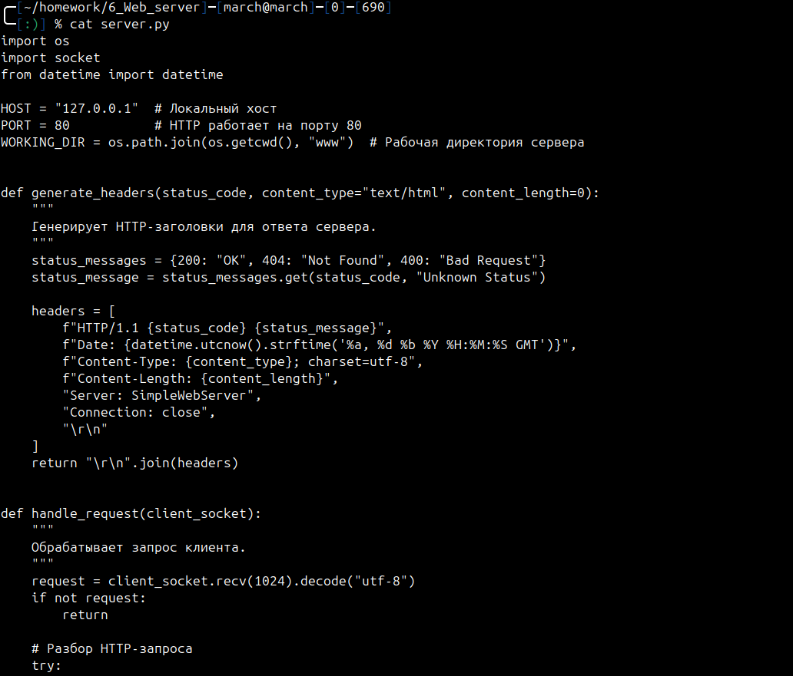
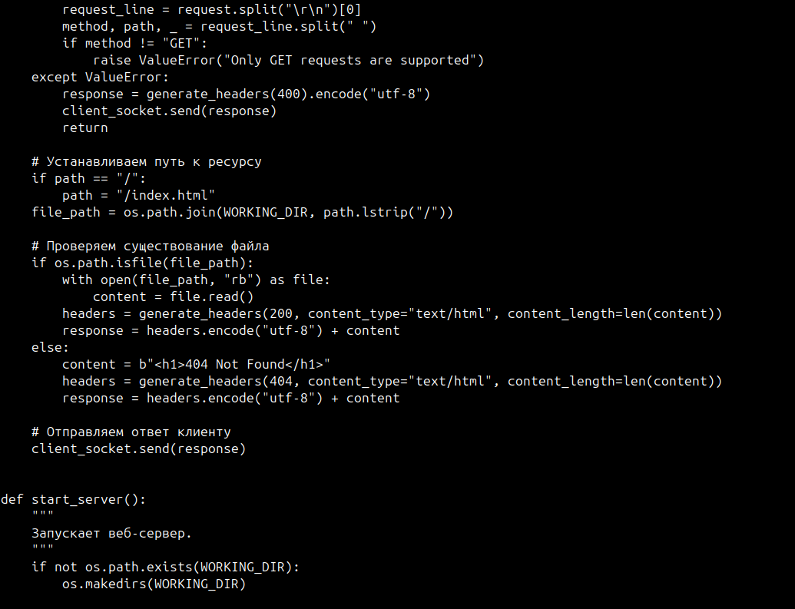
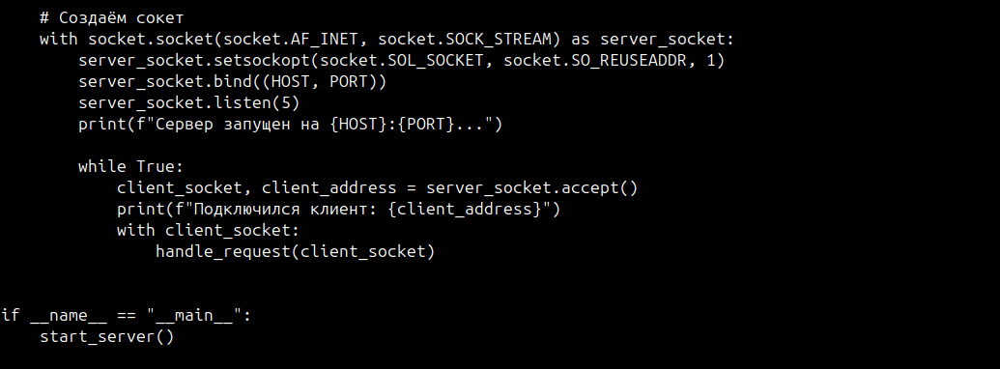
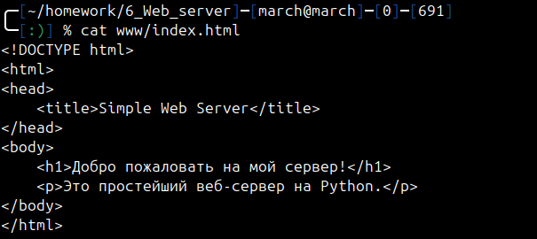
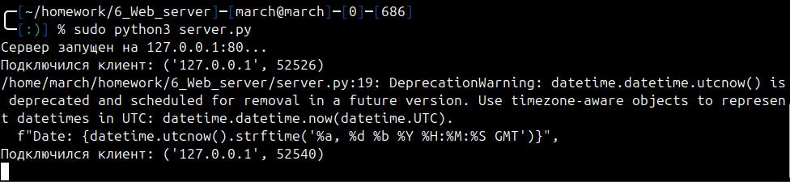
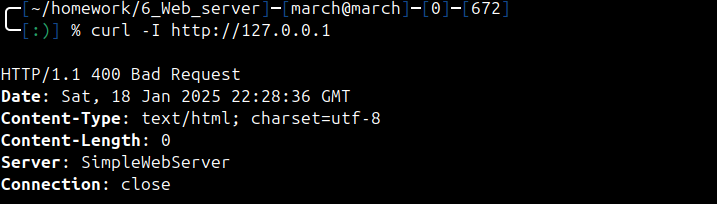
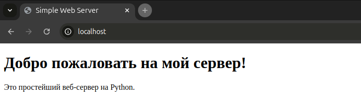
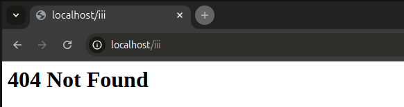

# Отчет по работе "Web Server"

## Основное задание

1. Написать простейший веб-сервер. Сервер должен принимать входящие соединения на порту 80 и отдавать пользователю содержимое запрошенного ресурса из определенной директории (рабочей директории сервера).
2. Разместите в рабочей директории сервера простой веб сайт, содержащий страницу index.html. Убедитесь, что при подключении к серверу, если не указан необходимый ресурс он отдает содержимое страницы index.html.
3. Познакомьтесь со спецификацией протокола HTTP. Узнайте, в каком формате клиент посылает запрос серверу и в каком формате сервер посылает ответ клиенту. Особое внимание уделите полям заголовка.
4. Сделайте так, чтобы к вашему серверу можно было обращаться по протоколу HTTP. Для этого не нужно реализовывать поддержку всех возможных нюансов, вам нужно лишь описать общий формат запросов и ответов и поддерживать некоторые поля заголовков.
5. Проверьте работу вашего сервера, обратившись к нему из адресной строки любого браузера. Для этого достаточно написать в ней адрес хоста, на котором работает сервер (localhost тоже подходит). Вы должны увидеть содержимое (не код) вашей страницы.
## Ход выполнения работы

Создан файл `server.py`, который принимает входящие соединения на порту 80 и отдает пользователю содержимое запрошенного ресурса из рабочей директории сервера.

Так же создадим файл `index.html` в рабочей директории сервера `/www`.

Запустим сервер:

Попробуем обратиться к серверу:

Видим, что заголовки отображаются.

Попробуем обратиться к серверу из адресной строки браузера. Он выводит содержимое файла `index.html`:

При попытке обратиться по адресу, для которого нет файла в рабочей директории отображается ошибка:

